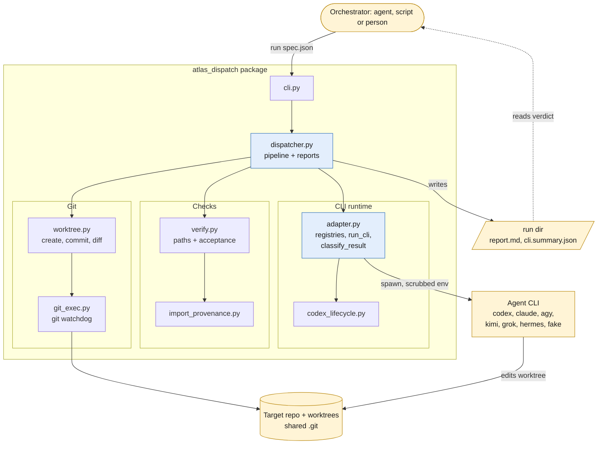
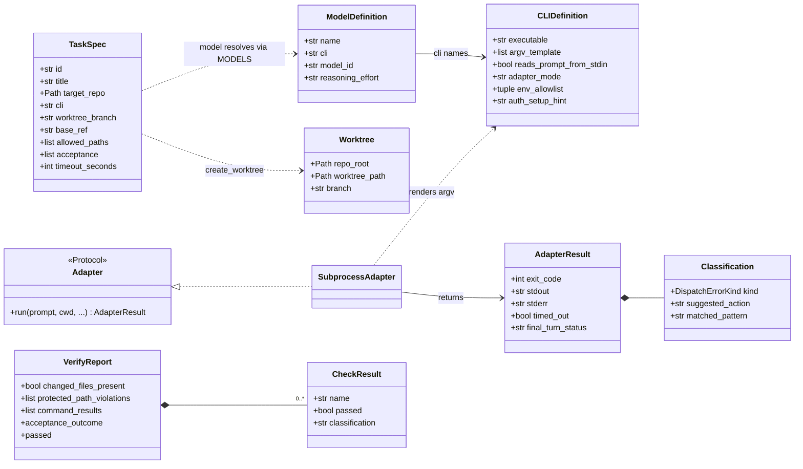
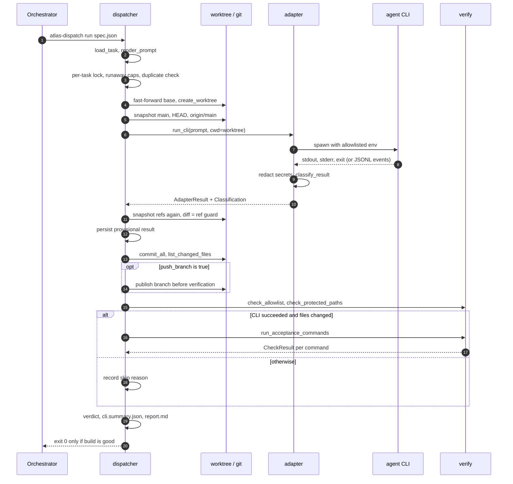
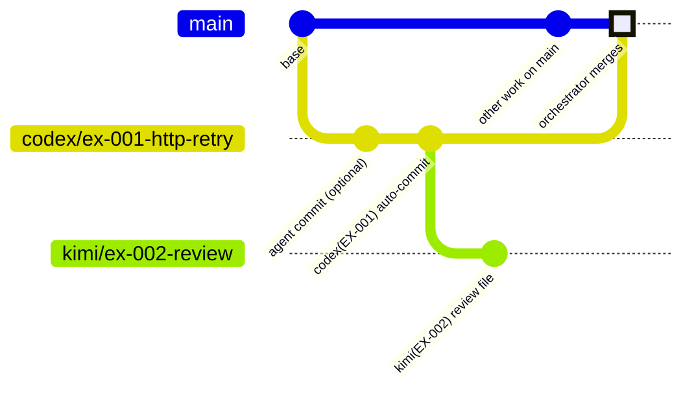
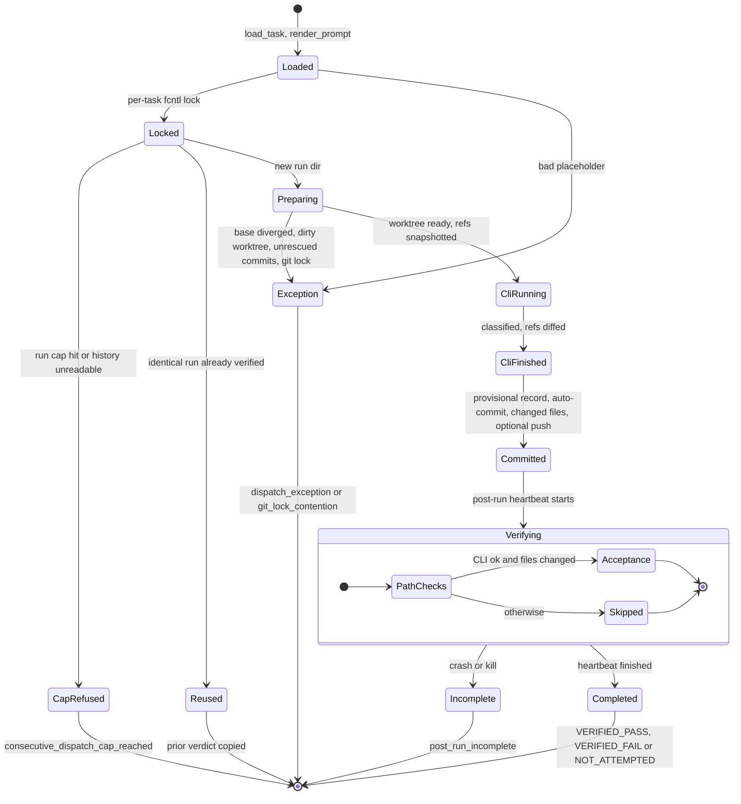
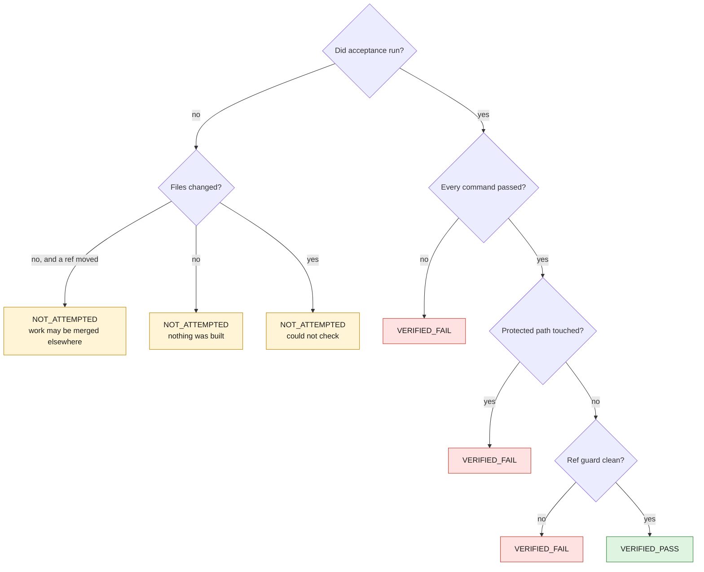
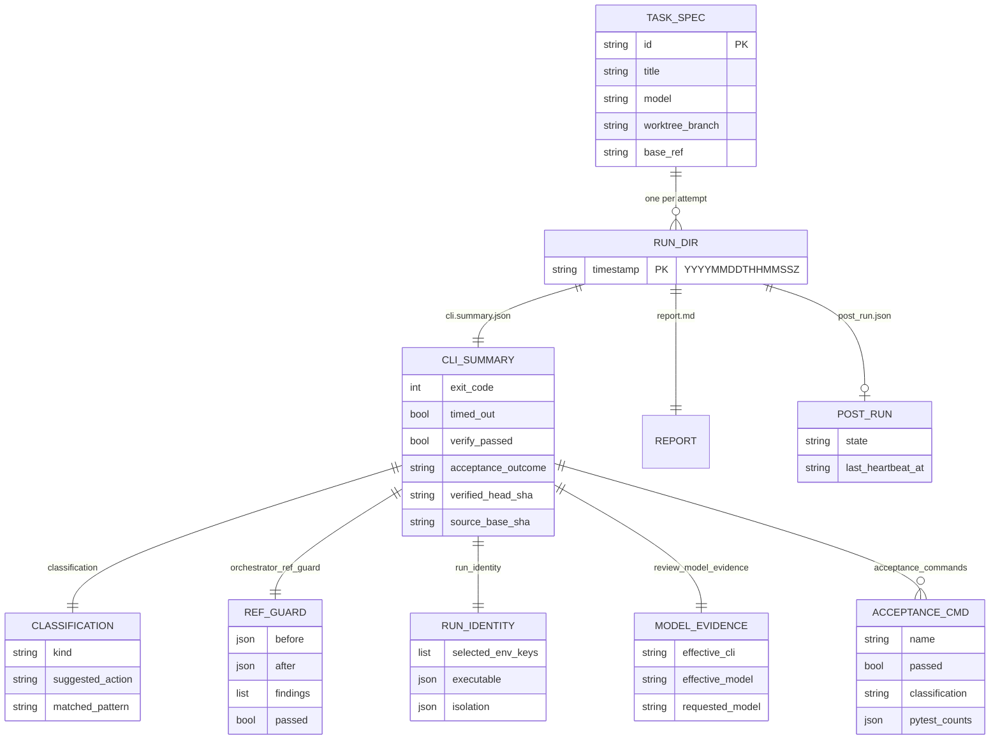
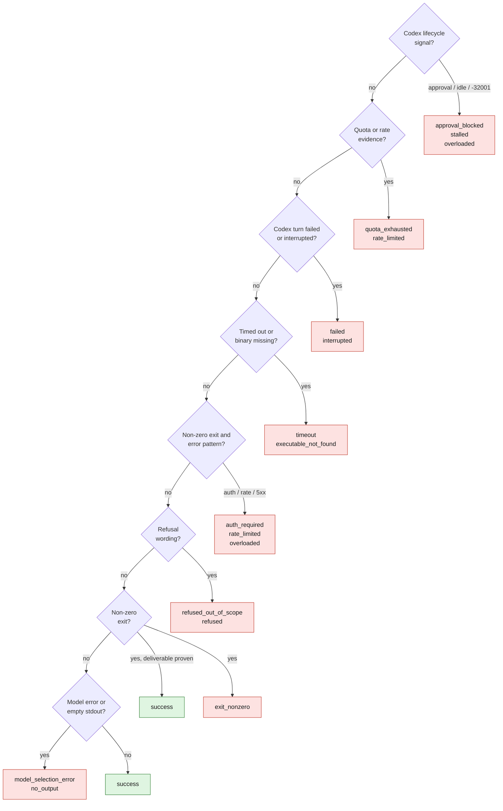
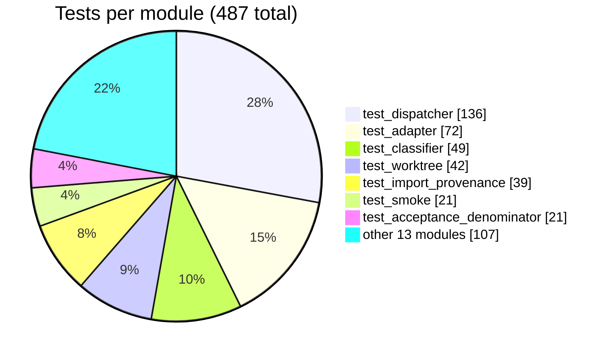

# atlas-dispatch

**Run a coding-agent CLI (Codex, Claude Code, Gemini, Kimi, Grok or Hermes) on one well-bounded task
in an isolated git worktree, and get back a verdict you can trust more than its exit code.**


[](LICENSE)


An orchestrator (an AI agent, a script or a person) writes a small JSON task spec. atlas-dispatch
creates a per-task worktree and branch, runs the CLI inside it with full-access flags and a
scrubbed environment, commits whatever it produced, checks the diff, runs the acceptance commands,
confirms that nothing outside the worktree moved, classifies the outcome and writes a structured
report. **It never merges.**

Python 3.11+, standard library only, about 12,000 lines of package code and 13,000 lines of tests.

<p align="center">
  
</p>

<sub>The quickstart above runs with no API key: `fake` is a deterministic stand-in agent that ships
with the package. Every line is real output from a Linux run.</sub>

## Contents

- [Why it exists](#why-it-exists)
- [What it checks](#what-it-checks)
- [Architecture](#architecture)
- [A dispatch, end to end](#a-dispatch-end-to-end)
- [Run lifecycle](#run-lifecycle)
- [Quick start (no API keys)](#quick-start-no-api-keys)
- [Task specs and run reports](#task-specs-and-run-reports)
- [Failure classification](#failure-classification)
- [Commands and configuration](#commands-and-configuration)
- [Project layout](#project-layout)
- [Testing](#testing)
- [Design decisions and limits](#design-decisions-and-limits)
- [License](#license)

## Why it exists

Handing real work to several frontier coding agents at once goes wrong in ways that are easy to
miss:

- **Exit 0 is not success.** A CLI can exit 0 after refusing the task, after hitting a quota it
  reported only in a JSON event, after printing nothing, or after changing nothing at all.
- **Agents need full access to be useful** (to install, build and run tests), so the CLI's own
  sandbox cannot be the safety boundary. Something else has to be.
- **A git worktree isolates files, not refs.** Every worktree shares the repository's `.git`. An
  agent in a worktree can fast-forward the orchestrator's `main`, and no file-based check will ever
  see it, because no file in the orchestrator's checkout changed.
- **Green tests can be about the wrong code.** A stale editable install means acceptance imports the
  parent checkout, not the worktree under test.
- **"Failed" and "never checked" look the same** if the result is a single boolean, and the natural
  reaction to "failed" is to throw the work away.

atlas-dispatch is the harness between the orchestrator and the implementer that makes each of those
visible.

## What it checks

Every guard below exists in the code and has tests. Guards in the left column run before or
around the CLI; the right column runs on the committed result. Grey boxes are informational and never
fail a run on their own.


| Guard | What it does | Where |
|---|---|---|
| Env allowlist | The CLI gets locale, proxy, TLS and identity variables, its own declared keys, a rebuilt `PATH`, and isolation settings (`GIT_CONFIG_GLOBAL=/dev/null`, no terminal prompts, `PYTHONNOUSERSITE=1`). Nothing else. | `adapter._prepare_cli_subprocess_environment` |
| Secret redaction | Values of secret-looking allowlisted keys are replaced with `<redacted-env:KEY>` in captured output; credential-bearing argv values are redacted before they are written. `run-identity.json` records key names, never values. | `adapter._finalize_cli_subprocess_result`, `dispatcher._sanitize_command_for_artifact` |
| Ref guard | Snapshots `main`, `HEAD` and the remote's `main` before and after the CLI. Any movement, or an unreadable local ref, fails verification even when acceptance passed. | `dispatcher._capture_orchestrator_refs` |
| Protected paths | Changed files matching `configs/prod.*`, `migrations/**`, `secrets/**` or `.github/workflows/**` (configurable only from the harness environment, never from a spec) fail verification. | `verify.check_protected_paths` |
| Allowlist | `allowed_paths` / `forbidden_paths` are measured and reported, deliberately **not** enforced. | `verify.check_allowlist` |
| Import provenance | Before a pytest-bearing command, probes that first-party packages import from the worktree, not a stale editable install. Fails closed. | `import_provenance.py` |
| Acceptance | At least one command must run and every one must pass; a per-command timeout kills the whole process group. | `verify.run_acceptance_commands` |
| Collection floor | `acceptance_min_collected` fails a pytest run that collected fewer tests than declared. | `verify._parse_pytest_counts` |
| Runaway caps | Refuses a task id with 100 run directories, or 3 runs of the same task and base in 5 minutes. Fails closed if history is unreadable. | `dispatcher._dispatch_loaded_task` |
| Branch rescue | Reusing a branch with commits that exist nowhere else saves them under `refs/rescue/...` and refuses the reset unless the spec sets `allow_destructive_branch_reset`. | `worktree._reset_existing_branch_for_reuse` |

## Architecture

The dispatcher is the orchestration layer; `adapter` is the CLI abstraction; `worktree`, `verify`,
`import_provenance` and `git_exec` are leaves. There are no runtime dependencies.



### Core types

The public API (`from atlas_dispatch import ...`) is built around a handful of frozen dataclasses. A
new runtime only has to implement the `Adapter` protocol and return an `AdapterResult`; classification
and everything downstream are unchanged.



## A dispatch, end to end

What `dispatch(spec_path)` does, in code order. The full 18-step list is in
[docs/ARCHITECTURE.md](docs/ARCHITECTURE.md#the-pipeline-in-code-order).



### The branch model

Each task gets its own branch and worktree, cut from `base_ref`. The harness auto-commits what the
agent left as `<cli>(<task-id>): <title>`. A cross-model review is a second spec whose `base_ref` is
the implementer's branch. Merging is always the orchestrator's move, outside the harness.



## Run lifecycle

Every attempt ends in exactly one terminal record in `.atlas-dispatch/runs/<task-id>/<UTC timestamp>/`,
including attempts that never reach the CLI. The CLI result is persisted as a provisional
`post_run_incomplete` record *before* verification starts, so a crash or kill during a long test suite
cannot be mistaken for a verdict.



A completed run gets one of three verdicts from `verification_verdict()`. `NOT_ATTEMPTED` is
deliberately not `VERIFIED_FAIL`: a run killed halfway through its tests produced no evidence that
the code is wrong, and the report labels it **"not a verdict"**.



`verify_passed` in `cli.summary.json` stays a boolean for machines (`true` only for
`VERIFIED_PASS`); `atlas-dispatch run` exits 0 only when the CLI succeeded **and** `verify_passed`.

## Quick start (no API keys)

atlas-dispatch ships a deterministic stand-in agent, registered as the `fake` CLI (model
`fake/scripted`). It takes its instructions literally from `FAKE-AGENT` directives in the prompt, so
the whole pipeline runs with no account, no key and no network. Requires macOS or Linux (WSL works),
`git` and Python 3.11+.

```bash
git clone https://github.com/JoshSimerman/atlas-dispatch.git && cd atlas-dispatch
python3 -m venv .venv && .venv/bin/pip install -e .

# Build a throwaway repo (calc.py + unittest) with four example task specs.
# The script deletes and recreates the directory you give it.
examples/quickstart/setup_demo_repo.sh /tmp/atlas-dispatch-demo

.venv/bin/atlas-dispatch run /tmp/atlas-dispatch-demo/calc/dispatch_tasks/T-001-add-subtract.json
```

The other three specs demonstrate the failure modes the harness exists for:

| Spec | What the agent does | What atlas-dispatch reports |
|---|---|---|
| `T-001-add-subtract` | adds `subtract()` and a test | `success`, `VERIFIED_PASS`, exit 0 |
| `T-002-agent-moves-main` | writes the code, then points `main` at its own commit | CLI `success`, ref guard **failed**, `verify_passed=False` |
| `T-003-rate-limited` | prints a 429 and exits 1 | `rate_limited`, with "wait and retry, or switch CLI" |
| `T-004-touches-protected-path` | adds `migrations/0001_add_index.sql` | acceptance **passed**, protected path hit, `VERIFIED_FAIL` |

<p align="center">
  
</p>

After all four runs, the demo repository keeps every worktree and branch for review, and each run
directory holds its verdict:

<p align="center">
  
</p>

`tests/test_quickstart.py` runs all four specs through the real pipeline with no mocks.

To use a real CLI, install it, log in, and use a registry model in the spec (`atlas-dispatch models`
lists them). Any other command-line agent can be wired in without code through the
`ATLAS_DISPATCH_<CLI>_CMD` override. `atlas-dispatch doctor` shows which CLIs are on `PATH`, any active
overrides, and the protected paths in force.

## Task specs and run reports

A spec is one JSON object. `model` names a registry entry that resolves to a CLI, a model id and a
reasoning effort; use `cli` + `model_id` + `reasoning_effort` for a combination the registry does not
have. Every field, its default and its validation are in
[docs/SPEC_REFERENCE.md](docs/SPEC_REFERENCE.md).

```json
{
  "id": "EX-001",
  "title": "Add retry with exponential backoff to the HTTP client",
  "target_repo": "my-service",
  "model": "codex/gpt-6-sol-high",
  "prompt_template": "../prompts/implement.md",
  "worktree_branch": "codex/ex-001-http-retry",
  "base_ref": "main",
  "allowed_paths": ["src/my_service/http_client.py", "tests/test_http_client.py"],
  "forbidden_paths": ["src/my_service/settings.py", "pyproject.toml"],
  "acceptance": [
    ".venv/bin/python -m pytest tests/test_http_client.py -q",
    ".venv/bin/python -m pytest -q"
  ],
  "acceptance_min_collected": {".venv/bin/python -m pytest tests/test_http_client.py -q": 5},
  "timeout_seconds": 1800,
  "extra_prompt_vars": {
    "task_summary": "Wrap HttpClient.get in a retry loop ...",
    "shape_guidance": "Keep the public signature unchanged. No new dependencies."
  }
}
```

The prompt is a Markdown template with `{{placeholders}}` ([examples/prompts/](examples/prompts/)).
A placeholder the spec does not fill stops the dispatch before anything runs. Cross-model review is
the same mechanism pointed the other way; see
[examples/tasks/EX-002-review.kimi.json](examples/tasks/EX-002-review.kimi.json).

### What a run leaves behind

`report.md` is for people; `cli.summary.json` carries the same facts for machines. The diagram shows
how a spec relates to its runs and the main records inside `cli.summary.json` (field names as written
by the code; not every field is shown).



Alongside those, the run directory holds the rendered `prompt.md`, the resolved `task.json`, raw
`cli.stdout.txt` / `cli.stderr.txt`, `changed_files.txt`, `combined-<sha>.diff`,
`orchestrator_refs.json` and `run-identity.json`. The full list is in
[docs/ARCHITECTURE.md](docs/ARCHITECTURE.md#run-artifacts). When the ref guard fires (quickstart
`T-002`), the report says what moved and does not guess who moved it:

```markdown
- Ref guard passed: **False**
- **A REF OUTSIDE THE WORKTREE MOVED OR COULD NOT BE READ:**
  - main moved during this run: <sha before> -> <sha after> (the dispatched agent or the
    orchestrator; a worktree isolates files, not refs)
```

Run artifacts are machine-specific (absolute paths; the error recorded for a refused branch reset
names the hostname). Keep `.atlas-dispatch/` out of version control, as the quickstart does.

## Failure classification

`classify_result()` reads stderr and stdout (tail-biased to the last 256 KB) plus Codex's JSONL
lifecycle events where they exist, checks conditions **in a fixed order** and returns the first match.
The order is the design: a timeout that also printed "rate limit" is a timeout, and a non-zero exit
that mentions a 401 is an auth problem.



Each box on the right lists the outcomes decided at that step, in the order the code checks them. Every classification carries a concrete `suggested_action`, and the
dispatcher adds `no_change` (the CLI "succeeded" but the worktree's `HEAD` did not move and nothing
was left uncommitted). Patterns are added only from captured real output and pinned by tests that use
that text verbatim. Every value, its trigger and its suggested action:
[docs/FAILURE_MODES.md](docs/FAILURE_MODES.md).

## Commands and configuration

```text
atlas-dispatch run <spec.json> [--no-reuse]   dispatch one task
atlas-dispatch doctor                         CLIs on PATH, overrides, git, protected paths
atlas-dispatch clis                           registered CLI adapters
atlas-dispatch models                         registered model names
atlas-dispatch capabilities <cli>             argv template, patterns and models for one CLI
```

In-process callers use `from atlas_dispatch import dispatch`; `dispatch(Path("spec.json"))` returns
the same exit code.

Registered CLIs: `codex`, `claude`, `gemini` (the Antigravity `agy` binary), `kimi-code`, `grok`,
`hermes`, the legacy `kimi` and streaming `kimi-streaming` definitions, and `fake`. Codex runs through
a JSONL lifecycle parser that can tell a stalled turn from a slow one; Kimi's streaming mode speaks
JSON-RPC over stdio; everything else is a plain subprocess.

| Variable | Meaning |
|---|---|
| `ATLAS_DISPATCH_<CLI>_CMD` | Replace a CLI's argv entirely (shell-quoted; `{cwd}`, `{model}`, `{reasoning_effort}`, `{prompt}` are substituted). Also how an unregistered CLI is wired in. |
| `ATLAS_DISPATCH_CODE_ROOTS` | Directories (`:`-separated) searched, in order, for a single-segment `target_repo` such as `"my-service"`. Default `~/code`. |
| `ATLAS_DISPATCH_PROTECTED_PATTERNS` | Comma- or newline-separated globs that replace the default protected paths. Empty disables the floor. Read from the harness environment, never from a spec. |
| `ATLAS_DISPATCH_ABSOLUTE_RUN_CAP` | Maximum run directories per task id before dispatch refuses (default 100). |
| `ATLAS_DISPATCH_ALLOW_CONSECUTIVE_DISPATCH=1` | Override the runaway caps for one intentional run. |
| `ATLAS_DISPATCH_ALLOW_DUPLICATE_RUN=1` | Force a fresh CLI run even when an identical verified run exists. |
| `ATLAS_DISPATCH_GIT_TIMEOUT_SECONDS` | Watchdog for every git subprocess (default 45). |

## Project layout

```text
atlas-dispatch/
├── atlas_dispatch/
│   ├── cli.py                console entry point -> dispatcher.main
│   ├── dispatcher.py         TaskSpec, load_task, render_prompt, dispatch(): the pipeline,
│   │                         runaway caps, duplicate-run reuse, ref guard, report writing
│   ├── adapter.py            CLIS / MODELS registries, command rendering, subprocess,
│   │                         Codex JSONL and Kimi Wire runtimes, env policy, classify_result
│   ├── codex_lifecycle.py    parser and state for `codex exec --json` events
│   ├── worktree.py           worktrees, branch rescue, auto-commit, changed files,
│   │                         per-worktree venv, branch publication
│   ├── verify.py             allowlist, protected paths, acceptance runner, pytest counts
│   ├── import_provenance.py  probe that acceptance imports the worktree, not a stale install
│   ├── git_exec.py           every git call: watchdog timeout, non-interactive env
│   ├── doctor.py             read-only environment report
│   └── fake_agent.py         deterministic stand-in agent behind the `fake` CLI
├── docs/                     architecture, failure modes, design decisions, spec reference
├── examples/
│   ├── quickstart/           setup_demo_repo.sh: the no-API-key demo
│   ├── tasks/                example specs (implement, cross-model review, explicit CLI)
│   └── prompts/              implement.md and review.md templates
└── tests/                    20 test modules, 487 tests
```

## Testing

```bash
python3 -m venv .venv && .venv/bin/pip install -e . pytest
.venv/bin/python -m pytest -q
```

The tests never call a real model. Most of them run real `git` against temporary repositories; the
CLI is either a fake subprocess or the quickstart's stand-in agent. The suite passes on Linux with
Python 3.11, 3.12 and 3.13.



The largest modules pin the behaviour that matters most: the pipeline and its failure records
(`test_dispatcher.py`), CLI invocation, environment policy and classification (`test_adapter.py`,
`test_classifier.py`), and the git edge cases (`test_worktree.py`), including a real high-similarity
rename that must not escape the protected-path floor.

## Design decisions and limits

The reasoning behind the shape is written up as ADRs in
[docs/DESIGN_DECISIONS.md](docs/DESIGN_DECISIONS.md). In short:

- **The worktree is the boundary; the CLI runs with full access inside it.** This is not a sandbox:
  the harness contains the *diff*, not the process. Run it as a user and on a machine whose blast
  radius you accept, or inside a container you provide.
- **It never merges agent work.** The only ref it moves in your checkout is a fast-forward of the
  local base branch to its remote before the worktree is created (`merge --ff-only`; it refuses on
  divergence).
- **The ref guard detects; it does not prevent or roll back.** It watches `main`, `HEAD` and
  `origin/main` by name, so a repository whose base branch is not `main` is guarded through `HEAD`
  only.
- **The allowlist is informational**, by design. The hard floor is the protected-path list, which a
  spec cannot lower.
- **Failure classification is pattern-based.** New wording from a vendor lands as `exit_nonzero`
  until a pattern is added. An honest `exit_nonzero` costs a read; a confident wrong class costs a
  wrong action.
- **One task, one process.** There is no queue, scheduler or daemon.
- **Unix only** (macOS, Linux): it uses `fcntl` locks and POSIX process groups.

| Document | Contents |
|---|---|
| [docs/ARCHITECTURE.md](docs/ARCHITECTURE.md) | Modules, registries, extension points, the pipeline in code order, run artifacts, concurrency |
| [docs/FAILURE_MODES.md](docs/FAILURE_MODES.md) | Every classification, its trigger and its suggested action |
| [docs/DESIGN_DECISIONS.md](docs/DESIGN_DECISIONS.md) | Ten ADRs: why it is shaped this way, what it cost, what I would change next |
| [docs/SPEC_REFERENCE.md](docs/SPEC_REFERENCE.md) | Every task-spec field and prompt variable |

## License

Copyright (c) 2026 Josh Simerman. Licensed under the GNU Affero General Public License v3.0 or later.
See [LICENSE](LICENSE).
