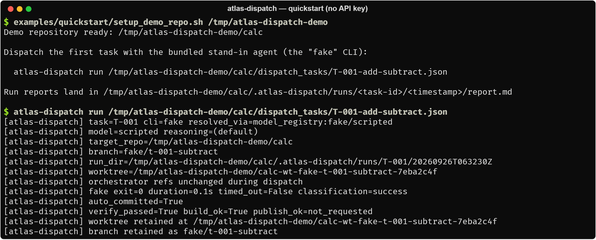
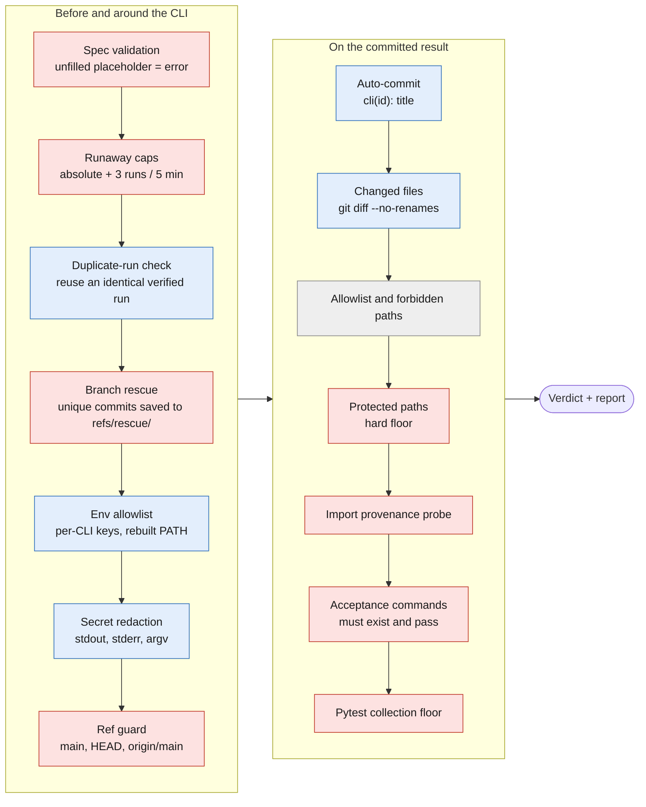
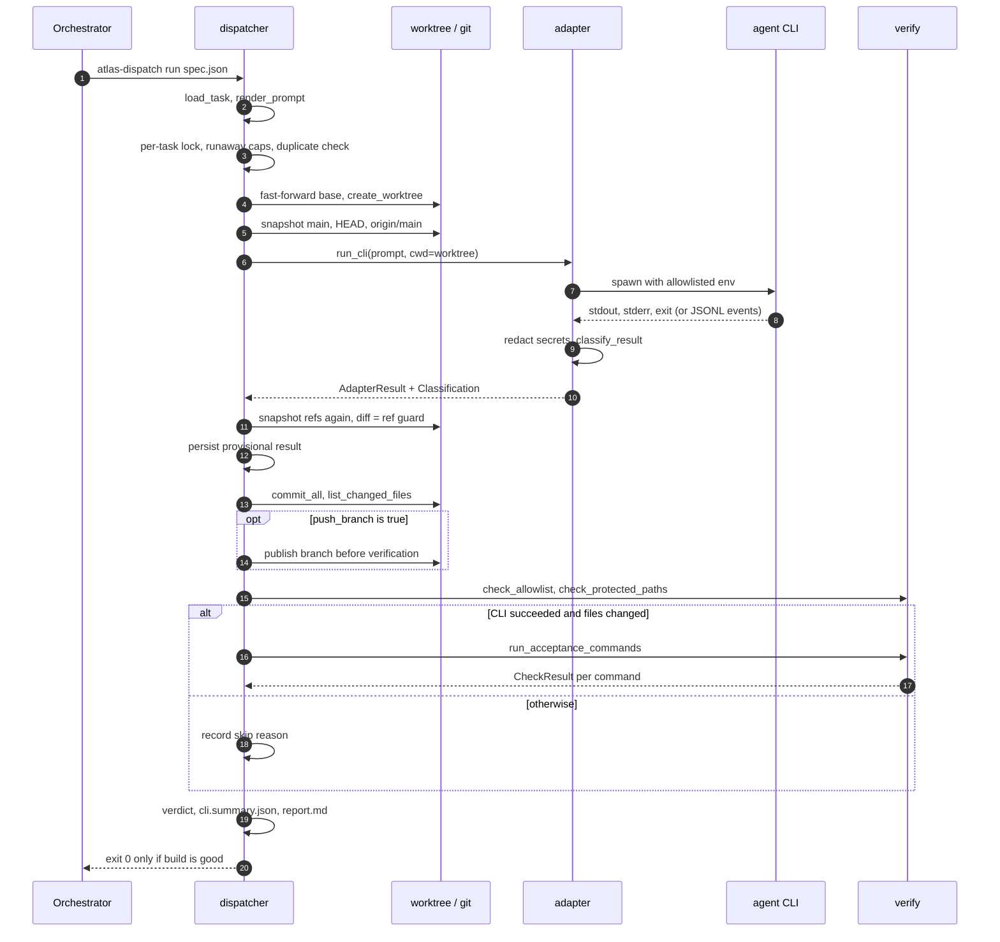
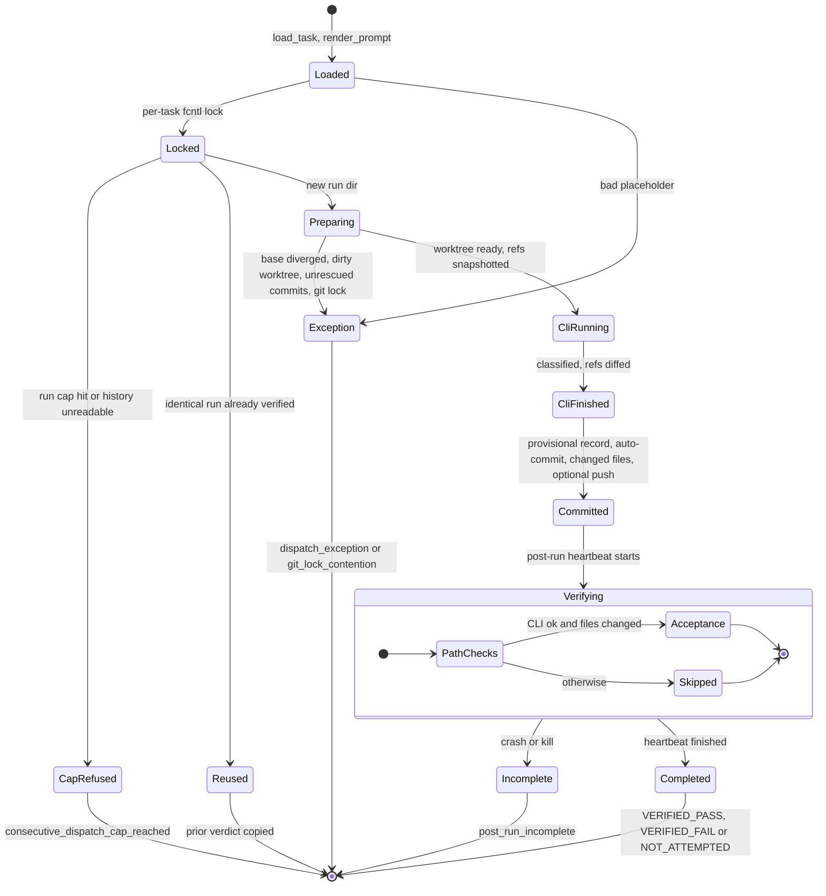

# atlas-dispatch

**Run a coding-agent CLI (Codex, Claude Code, Gemini, Kimi, Grok or Hermes) on one well-bounded task
in an isolated git worktree, and get back a verdict you can trust more than its exit code.**

[](https://github.com/JoshSimerman/atlas-dispatch/actions/workflows/ci.yml)

[](LICENSE)


An orchestrator (an AI agent, a script or a person) writes a small JSON task spec. atlas-dispatch
creates a per-task worktree and branch, runs the CLI inside it with full-access flags and a scrubbed
environment, commits whatever it produced, checks the diff, runs the acceptance commands, confirms
that nothing outside the worktree moved, classifies the outcome and writes a structured report.
**It never merges.** Python 3.11+, standard library only.

<p align="center">
  
</p>

<sub>The quickstart above runs with no API key: `fake` is a deterministic stand-in agent that ships
with the package. Every line is real output from a Linux run.</sub>

## Why it exists

Handing real work to coding agents fails quietly. **Exit 0 is not success**: a CLI can exit 0 after
refusing the task, hitting a quota, printing nothing or changing nothing. Agents need full access to
be useful, so the CLI's own sandbox cannot be the safety boundary. **A git worktree isolates files,
not refs**: an agent in a worktree can fast-forward the orchestrator's `main`, and no file check will
see it. Green tests can be about the wrong code when a stale editable install shadows the worktree.
And "failed" and "never checked" look the same if the result is one boolean. atlas-dispatch is the
harness that makes each of those visible.

## Quick start (no API keys)

atlas-dispatch ships a deterministic stand-in agent, registered as the `fake` CLI (model
`fake/scripted`), so the whole pipeline runs with no account, key or network. Requires macOS or Linux
(WSL works), `git` and Python 3.11+.

```bash
git clone https://github.com/JoshSimerman/atlas-dispatch.git && cd atlas-dispatch
python3 -m venv .venv && .venv/bin/pip install -e .

# Build a throwaway repo (calc.py + unittest) with four example task specs.
# The script deletes and recreates the directory you give it.
examples/quickstart/setup_demo_repo.sh /tmp/atlas-dispatch-demo

.venv/bin/atlas-dispatch run /tmp/atlas-dispatch-demo/calc/dispatch_tasks/T-001-add-subtract.json
```

The other three demo specs show the failure modes the harness exists for:

| Spec | What the agent does | What atlas-dispatch reports |
|---|---|---|
| `T-002-agent-moves-main` | writes the code, then points `main` at its own commit | ref guard **failed**, `verify_passed=False` |
| `T-003-rate-limited` | prints a 429 and exits 1 | `rate_limited`, with "wait and retry, or switch CLI" |
| `T-004-touches-protected-path` | adds `migrations/0001_add_index.sql` | acceptance **passed**, `VERIFIED_FAIL` |

Screenshots of those runs, real CLIs, writing specs, commands and configuration:
[docs/USAGE.md](docs/USAGE.md).

## What it checks

Guards on the left run before or around the CLI; those on the right run on the committed result.
Grey boxes are informational and never fail a run on their own. What each guard does and where it
lives: [docs/ARCHITECTURE.md](docs/ARCHITECTURE.md#guards).



## A dispatch, end to end

What `dispatch(spec_path)` does, in code order (every step:
[docs/ARCHITECTURE.md](docs/ARCHITECTURE.md#the-pipeline-in-code-order)).



## Run lifecycle

Every attempt ends in exactly one terminal record in `.atlas-dispatch/runs/<task-id>/<UTC timestamp>/`,
including attempts that never reach the CLI. The CLI result is persisted as a provisional
`post_run_incomplete` record *before* verification starts, so a crash during a long test suite cannot
be mistaken for a verdict.



A completed run is `VERIFIED_PASS`, `VERIFIED_FAIL` or `NOT_ATTEMPTED`; the last is deliberately not
a failure, and the report labels it **"not a verdict"**. `atlas-dispatch run` exits 0 only when the
CLI succeeded and verification passed. Every classification and verdict:
[docs/FAILURE_MODES.md](docs/FAILURE_MODES.md).

## Design decisions

| ADR | Decision |
|---|---|
| [001](docs/DESIGN_DECISIONS.md#adr-001-the-worktree-is-the-boundary-the-cli-runs-with-full-access-inside-it) | The worktree is the boundary; the CLI runs with full access inside it (not a sandbox) |
| [002](docs/DESIGN_DECISIONS.md#adr-002-the-harness-never-merges) | The harness never merges |
| [003](docs/DESIGN_DECISIONS.md#adr-003-worktrees-isolate-files-not-refs-so-there-is-a-ref-guard) | Worktrees isolate files, not refs, so there is a ref guard |
| [004](docs/DESIGN_DECISIONS.md#adr-004-acceptance-must-exist-and-pass-not-checked-is-not-failed) | Acceptance must exist and pass; "not checked" is not "failed" |
| [005](docs/DESIGN_DECISIONS.md#adr-005-auto-commit-with-a-deterministic-message) | Auto-commit with a deterministic message |
| [006](docs/DESIGN_DECISIONS.md#adr-006-cross-model-review-is-a-spec-not-a-feature) | Cross-model review is a spec, not a feature |
| [007](docs/DESIGN_DECISIONS.md#adr-007-a-protected-paths-floor-the-allowlist-is-informational) | A protected-paths floor; the allowlist is informational |
| [008](docs/DESIGN_DECISIONS.md#adr-008-failure-classification-is-ordered-pattern-based-and-measured) | Failure classification is ordered, pattern-based and measured |
| [009](docs/DESIGN_DECISIONS.md#adr-009-unfilled-template-placeholders-fail-loudly) | Unfilled template placeholders fail loudly |
| [010](docs/DESIGN_DECISIONS.md#adr-010-runaway-caps-that-cannot-be-defeated-by-the-runaway) | Runaway caps that cannot be defeated by the runaway |

## Documentation

| Document | Contents |
|---|---|
| [docs/USAGE.md](docs/USAGE.md) | The quickstart in full, real CLIs, writing specs, commands, configuration, layout, testing |
| [docs/ARCHITECTURE.md](docs/ARCHITECTURE.md) | Modules, core types, guards, the pipeline in code order, branch model, registries, run artifacts, concurrency |
| [docs/FAILURE_MODES.md](docs/FAILURE_MODES.md) | Every classification and verdict, its trigger and its suggested action |
| [docs/DESIGN_DECISIONS.md](docs/DESIGN_DECISIONS.md) | The ten ADRs: context, decision, cost, and what I would change next |
| [docs/SPEC_REFERENCE.md](docs/SPEC_REFERENCE.md) | Every task-spec field and prompt variable |

CI runs the test suite on Ubuntu with Python 3.11, 3.12 and 3.13 and smoke-tests the entry points.
The tests never call a real model.

## About this repository

This is a v1 snapshot exported from a private monorepo. Its history was squashed into a single
initial commit, so there is no earlier history to browse here.

## License

Copyright (c) 2026 Josh Simerman. Licensed under the GNU Affero General Public License v3.0 or later.
See [LICENSE](LICENSE).
