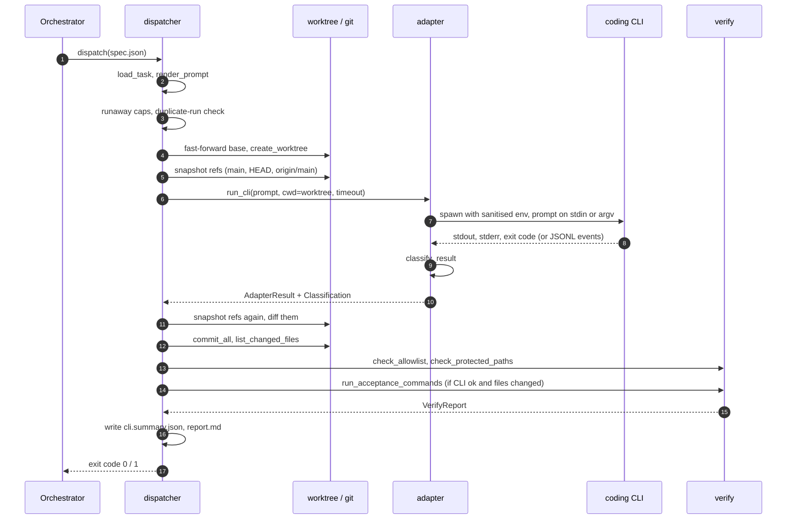
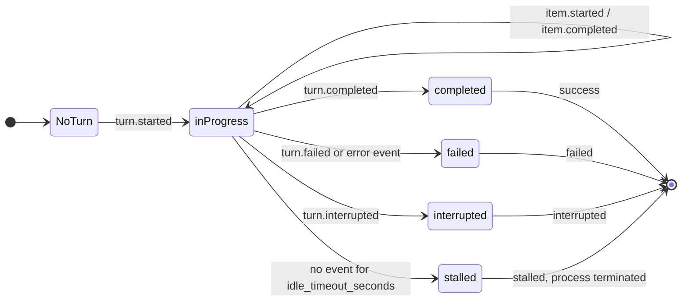

# Architecture

This is a design overview. For how to run it, see the [README](../README.md); for every spec field,
see [SPEC_REFERENCE.md](SPEC_REFERENCE.md); for the reasoning behind the shape, see
[DESIGN_DECISIONS.md](DESIGN_DECISIONS.md).

## Roles

- **Orchestrator** (the caller): an AI agent, a script or a person. It writes the task spec, calls
  `atlas-dispatch run`, reads the report, and decides what happens next: merge, re-dispatch, send a
  review task, or throw the branch away.
- **Implementer**: the coding-agent CLI session atlas-dispatch starts inside the task's worktree. It
  sees only the rendered prompt and the worktree.
- **The harness** (atlas-dispatch): everything in between. It never merges and never decides.

## Components

```
atlas_dispatch/
├── cli.py               console entry point → dispatcher.main
├── dispatcher.py        TaskSpec, load_task, render_prompt, dispatch(): the pipeline,
│                        runaway caps, duplicate-run reuse, ref guard, report writing
├── adapter.py           CLIS and MODELS registries, command rendering, the subprocess
│                        adapter (plain, Codex JSONL, Kimi Wire), env sanitising, classify_result
├── codex_lifecycle.py   parser and state machine for `codex exec --json` events
├── worktree.py          create/reuse worktrees, branch rescue, auto-commit, changed files,
│                        per-worktree venv, branch publication with remote containment proof
├── verify.py            allowlist measurement, protected paths, acceptance runner,
│                        pytest denominator parsing, collection floors
├── import_provenance.py probe that acceptance imports the worktree's packages, not a stale install
├── git_exec.py          every git call: watchdog timeout, non-interactive environment
├── doctor.py            read-only environment report
└── fake_agent.py        deterministic stand-in agent behind the `fake` CLI (quickstart, tests)
```

Roughly 12,000 lines of Python in the package and 13,000 in the tests. The dispatcher is the
orchestration layer; `adapter` is the CLI abstraction; `worktree`, `verify` and `git_exec` are
leaves. There are no runtime dependencies.

## The pipeline, in code order

`dispatch(spec_path)` in `dispatcher.py`:

1. **Load** the spec (`load_task`). Path fields resolve relative to the spec file; a single-segment
   `target_repo` resolves against the code roots (`ATLAS_DISPATCH_CODE_ROOTS`, default `~/code`). `model` resolves through `MODELS` to a CLI, a
   model id and an effort. Malformed fields raise before anything else happens.
2. **Render the prompt** (`render_prompt`). Built-in variables plus `extra_prompt_vars` are
   substituted; context files are inlined in fences sized so their own backticks cannot close them.
   A placeholder left in the *template* is a hard error.
3. **Take the per-task lock** (an `fcntl` lock beside the runs directory) and apply the
   **runaway caps**: an absolute count of run directories, then a time-window count of consecutive
   runs. Either refuses with a complete run record and no CLI invocation.
4. **Duplicate-run check.** If a prior run for the same task already verified, with an identical
   serialised task, identical rendered prompt and the same base commit, the harness records a new
   attempt satisfied by that run and does not invoke the CLI.
5. **Sync the base.** For `base_ref: main`, check out and fast-forward local `main` from its remote
   (`--ff-only`; divergence is an error). Other refs resolve to a local or remote-tracking ref.
6. **Create the worktree** (`create_worktree`) at `<repo>/../<repo>-wt-<branch-slug>-<hash>`. A
   stale clean worktree is removed first; a dirty one is refused. A reused branch is reset to
   `base_ref`; if it holds commits that exist nowhere else, they are first saved under
   `refs/rescue/...` and the reset is refused unless the spec sets
   `allow_destructive_branch_reset`. If the repository has a `.venv`, the worktree gets its own
   isolated venv (built with `uv`) with the worktree's packages installed editable.
7. **Prepare MCP config** for the CLI, if the spec declares servers.
8. **Record `HEAD` of the worktree and snapshot the protected refs** (`main`, `HEAD` and the
   advertised `origin/main`).
9. **Run the CLI** (`run_cli`) in the worktree with a sanitised environment and the task timeout.
10. **Snapshot the refs again and diff.** Any movement, or an unreadable local ref, is a finding.
11. **Reclassify no-change.** A CLI "success" whose worktree `HEAD` did not move and which left no
    uncommitted work becomes `no_change`.
12. **Persist the CLI result** as a provisional record (`post_run_incomplete`) so a crash from here
    on cannot be mistaken for a verdict.
13. **Auto-commit** everything left uncommitted: `git add -A` and `<cli>(<id>): <title>`.
14. **List changed files** with `git diff --name-only --no-renames base...HEAD`.
15. **Publish** the branch if `push_branch` is set, before verification, so a crash during a long
    test suite cannot lose the work.
16. **Verify** under a post-run heartbeat: measure the allowlist, check protected paths, and, if the
    CLI succeeded and files changed, run acceptance (with the import-provenance probe for
    pytest-bearing commands).
17. **Write** `combined-<sha>.diff`, the final `cli.summary.json` and `report.md`.
18. **Return** 0 only if the CLI succeeded and verification passed, including the ref guard.

The worktree and branch are left in place whatever the outcome.



## The CLI registry

`adapter.CLIS` maps a short name to a `CLIDefinition`:

| Field | Purpose |
|---|---|
| `executable`, `argv_template` | How to invoke the CLI non-interactively with full access. Placeholders: `{cwd}`, `{model}`, `{reasoning_effort}`, `{prompt}`. |
| `reads_prompt_from_stdin` | Whether the prompt goes on stdin or into argv (`{prompt}`). Sending it both ways breaks some CLIs, so it is one or the other. |
| `extra_auth_patterns`, `extra_rate_limit_patterns`, `extra_quota_exhausted_patterns`, `extra_overloaded_patterns`, `extra_refusal_patterns` | Regexes layered on the generic lists in `classify_result`. |
| `model_selection_error_patterns` | Exact exit-0 output meaning "that model does not exist for you". |
| `extra_post_completion_timeout_patterns` | Output that counts as success *only* if the run also produced its declared deliverable. |
| `auth_setup_hint` | The suggested action for `auth_required`. |
| `env_allowlist`, `credentials_file`, `credentials_env_map` | Exactly which environment variables may reach this CLI, and an optional dotenv file to lift credentials from. |
| `adapter_mode` | `subprocess` or `kimi_wire` (JSON-RPC over stdio). |

Registered: `codex`, `claude`, `gemini` (the Antigravity `agy` binary), `kimi-code`, `grok`,
`hermes`, plus the legacy `kimi` and streaming `kimi-streaming` definitions, and `fake`, the
bundled stand-in agent that needs no account. Run
`atlas-dispatch capabilities <cli>` to see any one of them.

**Three runtime paths.** Most CLIs run through `_run_subprocess_command`, which streams output to
temporary files (so a long-running caller does not hold megabytes in memory) and enforces the
timeout. `codex exec --json` runs through `_run_codex_json_command`, which parses lifecycle events
as they arrive: it can tell a stalled turn (no events for `idle_timeout_seconds`) from a slow one,
and it terminates a run that asks for approval, since nobody is there to give it. Kimi's Wire mode
speaks JSON-RPC and auto-answers approval requests.

The Codex turn state kept by `codex_lifecycle.apply_codex_event` as JSONL events arrive. The
adapter terminates the process itself on a stall or an approval request; the final status then
feeds `classify_result`, where an approval request or an overload error (`-32001`) takes
precedence over the turn status.



**The environment is an allowlist.** The CLI subprocess gets locale, proxy, TLS and identity
variables, its own `env_allowlist`, a rebuilt `PATH`, and a fixed set of isolation variables
(`GIT_CONFIG_GLOBAL=/dev/null`, no terminal prompts, no pager, `PYTHONNOUSERSITE=1`). Values of
secret-looking allowlisted keys are redacted from captured output. `run-identity.json` records which keys were
passed, never their values.

## The model registry

`adapter.MODELS` maps a logical name such as `codex/gpt-6-sol-high` to a `ModelDefinition(cli,
model_id, reasoning_effort, description)`. A spec that says `"model": "codex/gpt-6-sol-high"` gets
the CLI, the `-m` value and the effort without the author knowing any flags.

Every run records **review-model evidence**: the model that actually ran, derived from the rendered
command rather than from the name that was asked for. If the command carries no observable model
selection, the evidence says `unknown` instead of trusting the request. That matters for
cross-model review, where the whole point is that the reviewer is a different model family from the
builder (see DESIGN_DECISIONS, ADR-006).

## Extension points

**Add a model.** Add a `ModelDefinition` to `MODELS`. Run one real task through it and read the
report: an unregistered or inaccessible model id usually surfaces as `model_selection_error` or
`exit_nonzero`, not silently.

**Add a CLI.**

1. Try it without code first: `ATLAS_DISPATCH_MYCLI_CMD="mycli --yes --model {model} -"` plus
   `"cli": "mycli"` in a spec. An unregistered CLI runs through the plain subprocess path with the
   generic failure patterns and no CLI-specific environment keys.
2. When it earns a place, add a `CLIDefinition` to `CLIS`: its non-interactive, full-access argv;
   whether it reads the prompt from stdin; the environment keys it needs; and an auth hint.
3. Add failure patterns only from real output. Capture the CLI's actual stderr for a rate limit, an
   expired login and a refusal, add the narrowest regex that matches, and pin it with a test that
   uses the captured text verbatim (see `tests/test_classifier.py`).

**Add a runtime.** `adapter.Adapter` is a `Protocol` with one method,
`run(*, prompt, cwd, ...) -> AdapterResult`. A non-subprocess runtime (an SDK call, an app-server)
only has to return an `AdapterResult`; classification and everything downstream are unchanged.

**Add a task source.** `dispatch()` takes a path to a spec. A queue consumer, a CI job or another
agent can write a spec and call it; nothing in the harness assumes who the caller is.

## Run artifacts

`<target_repo>/.atlas-dispatch/runs/<task-id>/<YYYYMMDDTHHMMSSZ>[-NNN]/`

| File | Contents |
|---|---|
| `prompt.md` | The exact prompt the CLI received |
| `task.json` | The resolved task spec |
| `cli.stdout.txt`, `cli.stderr.txt` | Raw CLI output (secret values redacted) |
| `cli.summary.json` | The machine-readable record: classification, changed files, acceptance results, ref guard, post-run state, verdict |
| `report.md` | The human-readable report |
| `changed_files.txt` | One path per line, or an explicit `UNKNOWN: <reason>` |
| `combined-<sha>.diff` | `git diff base...HEAD` of the verified head |
| `orchestrator_refs.json` | Ref snapshots before and after, and findings |
| `post_run.json` | Heartbeat for the verification phase, so a killed run is distinguishable from a slow one |
| `run-identity.json` | Environment policy applied to the CLI: keys, executable path and hash |
| `branch_publish.json` | Only when `push_branch` is set |
| `import_provenance.json` | Only when the provenance probe ran |
| `rescue_refs.json`, `consecutive_dispatch_cap_refusal.json` | Only on those paths |

Critical files are written atomically (temp file, `fsync`, rename). Artifacts are
machine-specific (absolute paths; the error recorded for a refused branch reset names the
hostname), so `.atlas-dispatch/` belongs in the target repository's `.gitignore`.

## Concurrency

- One `fcntl` lock per task id serialises attempts at the same task, so the runaway caps and
  duplicate-run check see completed runs.
- One lock per repository serialises the base-branch sync.
- One lock per repository (in the shared `.git`) covers worktree creation.
- Different tasks on the same repository run in parallel, each in its own worktree. Two dispatches
  of the *same branch* at the same time are the caller's responsibility to avoid.

## What is deliberately not here

- **Merging.** See ADR-002.
- **Scheduling, queues, retries.** The orchestrator decides; the report tells it what happened and
  suggests what to do.
- **Remote execution.** Everything runs on the machine that calls `dispatch()`.
- **Structured-output parsing across CLIs.** CLIs do not agree on an error format, so classification
  reads text (plus Codex's lifecycle events where they exist).
