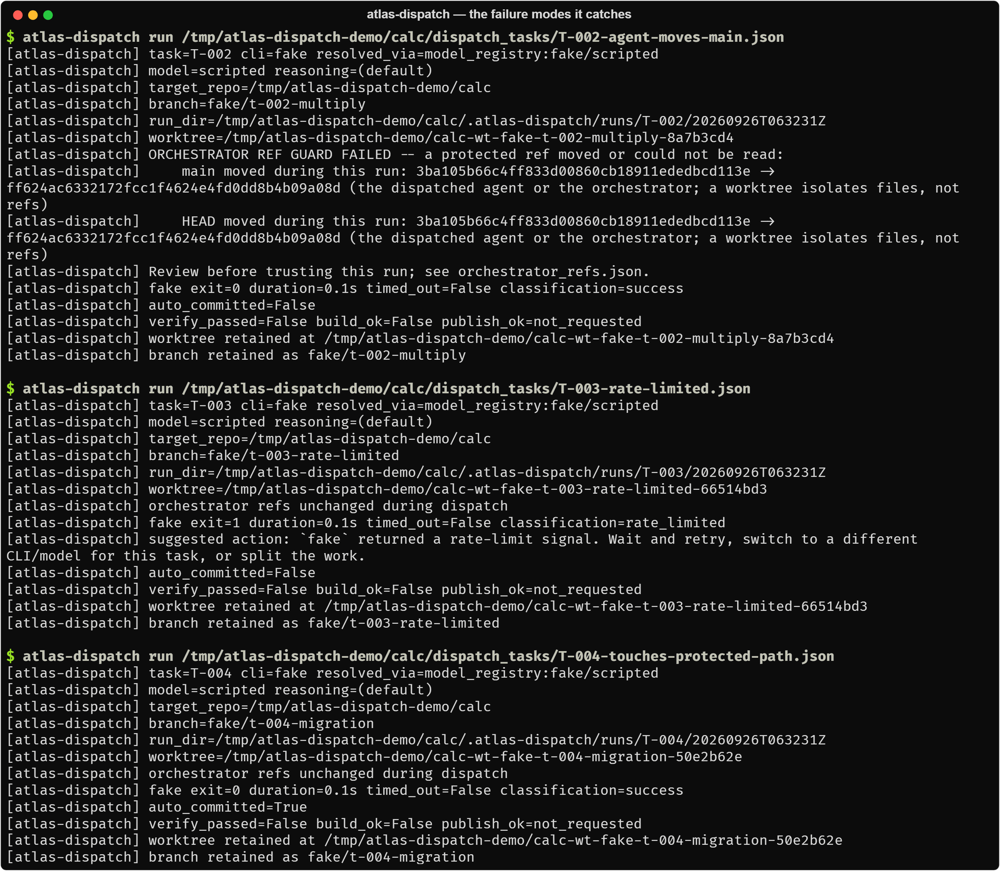
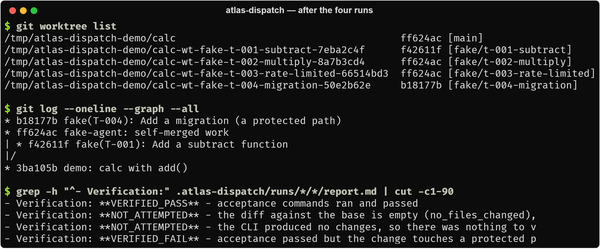

# Using atlas-dispatch

How to run it, write specs, and configure it. For the design, see [ARCHITECTURE.md](ARCHITECTURE.md);
for every spec field, see [SPEC_REFERENCE.md](SPEC_REFERENCE.md).

atlas-dispatch runs on macOS and Linux (WSL works). It needs `git` and Python 3.11+ and has no runtime
dependencies. It uses `fcntl` locks and POSIX process groups, so it does not run natively on Windows.

## The quickstart, in full

The [README quick start](../README.md#quick-start-no-api-keys) builds a throwaway demo repository with
four task specs and runs the first one with the bundled `fake` agent. The
other three specs demonstrate the failure modes the harness exists for:

| Spec | What the agent does | What atlas-dispatch reports |
|---|---|---|
| `T-001-add-subtract` | adds `subtract()` and a test | `success`, `VERIFIED_PASS`, exit 0 |
| `T-002-agent-moves-main` | writes the code, then points `main` at its own commit | CLI `success`, ref guard **failed**, `verify_passed=False` |
| `T-003-rate-limited` | prints a 429 and exits 1 | `rate_limited`, with "wait and retry, or switch CLI" |
| `T-004-touches-protected-path` | adds `migrations/0001_add_index.sql` | acceptance **passed**, protected path hit, `VERIFIED_FAIL` |

<p align="center">
  
</p>

After all four runs, the demo repository keeps every worktree and branch for review, and each run
directory holds its verdict:

<p align="center">
  
</p>

`tests/test_quickstart.py` runs all four specs through the real pipeline with no mocks.

To use a real CLI, install it, log in, and use a registry model in the spec (`atlas-dispatch models`
lists them). Any other command-line agent can be wired in without code through the
`ATLAS_DISPATCH_<CLI>_CMD` override. `atlas-dispatch doctor` shows which CLIs are on `PATH`, any active
overrides, and the protected paths in force.

## Writing a task spec

A spec is one JSON object. `model` names a registry entry that resolves to a CLI, a model id and a
reasoning effort; use `cli` + `model_id` + `reasoning_effort` for a combination the registry does not
have. Every field, its default and its validation are in
[docs/SPEC_REFERENCE.md](SPEC_REFERENCE.md).

```json
{
  "id": "EX-001",
  "title": "Add retry with exponential backoff to the HTTP client",
  "target_repo": "my-service",
  "model": "codex/gpt-6-sol-high",
  "prompt_template": "../prompts/implement.md",
  "worktree_branch": "codex/ex-001-http-retry",
  "base_ref": "main",
  "allowed_paths": ["src/my_service/http_client.py", "tests/test_http_client.py"],
  "forbidden_paths": ["src/my_service/settings.py", "pyproject.toml"],
  "acceptance": [
    ".venv/bin/python -m pytest tests/test_http_client.py -q",
    ".venv/bin/python -m pytest -q"
  ],
  "acceptance_min_collected": {".venv/bin/python -m pytest tests/test_http_client.py -q": 5},
  "timeout_seconds": 1800,
  "extra_prompt_vars": {
    "task_summary": "Wrap HttpClient.get in a retry loop ...",
    "shape_guidance": "Keep the public signature unchanged. No new dependencies."
  }
}
```

The prompt is a Markdown template with `{{placeholders}}` ([examples/prompts/](../examples/prompts/)).
A placeholder the spec does not fill stops the dispatch before anything runs. Cross-model review is
the same mechanism pointed the other way; see
[examples/tasks/EX-002-review.kimi.json](../examples/tasks/EX-002-review.kimi.json).

## Commands and configuration

```text
atlas-dispatch run <spec.json> [--no-reuse]   dispatch one task
atlas-dispatch doctor                         CLIs on PATH, overrides, git, protected paths
atlas-dispatch clis                           registered CLI adapters
atlas-dispatch models                         registered model names
atlas-dispatch capabilities <cli>             argv template, patterns and models for one CLI
```

In-process callers use `from atlas_dispatch import dispatch`; `dispatch(Path("spec.json"))` returns
the same exit code.

Registered CLIs: `codex`, `claude`, `gemini` (the Antigravity `agy` binary), `kimi-code`, `grok`,
`hermes`, the legacy `kimi` and streaming `kimi-streaming` definitions, and `fake`. Codex runs through
a JSONL lifecycle parser that can tell a stalled turn from a slow one; Kimi's streaming mode speaks
JSON-RPC over stdio; everything else is a plain subprocess.

| Variable | Meaning |
|---|---|
| `ATLAS_DISPATCH_<CLI>_CMD` | Replace a CLI's argv entirely (shell-quoted; `{cwd}`, `{model}`, `{reasoning_effort}`, `{prompt}` are substituted). Also how an unregistered CLI is wired in. |
| `ATLAS_DISPATCH_CODE_ROOTS` | Directories (`:`-separated) searched, in order, for a single-segment `target_repo` such as `"my-service"`. Default `~/code`. |
| `ATLAS_DISPATCH_PROTECTED_PATTERNS` | Comma- or newline-separated globs that replace the default protected paths. Empty disables the floor. Read from the harness environment, never from a spec. |
| `ATLAS_DISPATCH_ABSOLUTE_RUN_CAP` | Maximum run directories per task id before dispatch refuses (default 100). |
| `ATLAS_DISPATCH_ALLOW_CONSECUTIVE_DISPATCH=1` | Override the runaway caps for one intentional run. |
| `ATLAS_DISPATCH_ALLOW_DUPLICATE_RUN=1` | Force a fresh CLI run even when an identical verified run exists. |
| `ATLAS_DISPATCH_GIT_TIMEOUT_SECONDS` | Watchdog for every git subprocess (default 45). |

## Repository layout

```text
atlas-dispatch/
├── atlas_dispatch/           the package: dispatcher.py sequences the pipeline, one module
│                             per step (module map in docs/ARCHITECTURE.md#components)
├── docs/                     usage, architecture, failure modes, design decisions, spec reference
├── examples/
│   ├── quickstart/           setup_demo_repo.sh: the no-API-key demo
│   ├── tasks/                example specs (implement, cross-model review, explicit CLI)
│   └── prompts/              implement.md and review.md templates
└── tests/                    20 test modules
```

## Testing

```bash
python3 -m venv .venv && .venv/bin/pip install -e . pytest
.venv/bin/python -m pytest -q
```

The tests never call a real model. Most of them run real `git` against temporary repositories; the
CLI is either a fake subprocess or the quickstart's stand-in agent. CI runs the suite on Ubuntu with
Python 3.11, 3.12 and 3.13 and smoke-tests the entry points (`--help`, `run --help`, `doctor`).

The largest modules pin the behaviour that matters most: the pipeline and its failure records
(`test_dispatcher.py`), CLI invocation, environment policy and classification (`test_adapter.py`,
`test_classifier.py`), and the git edge cases (`test_worktree.py`), including a real high-similarity
rename that must not escape the protected-path floor.
